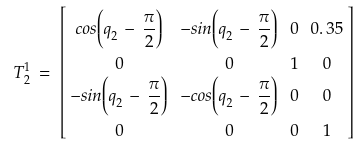
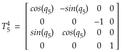

# <span style="color:teal"> Project: Kinematics Pick & Place

### Writeup by Tuan Le
### June 2018

# 1. Forward and Inverse Kinematic Analysis

## 1.1 Extracting Information from URDF file
From the <span style="color:crimson"> `kr210.urdf.xacro` </span> file, I extracted both x, y, z position and roll, pitch, yaw orientation of each joint of the KR210 robotic arm. Picture below shows a part of the URDF code. I highlight any section that are related to position and orientation information.

```xml
1 <link name="link_1">
2  <inertial>
3    <origin xyz="0 0 0.4" rpy="0 0 0"/>
4    <mass value="${mass1}"/>
5    <inertia ixx="30" ixy="0" ixz="0" iyy="50" iyz="0" izz="50"/>
6  </inertial>
```
Position and orientation of a joint are shown in line 3 as well as a link length of this joint. From these information, I formed a Denavit-Hartenberg table with four parameters (twist angle - **alpha**, link offset - **d** , link length - **a**, and joint angle - **theta**).

Here is a summary table of position and orientation information according to the <span style="color:crimson"> `kr210.urdf.xacro` </span> file.

Joint name|Parent link|Child link|x (meter)| y (meter)| z (meter)|roll (deg)|pitch (deg)|yaw (deg)|
-|-|-|-|-|-|-|-|-|
Joint 0  | base_footprint | base_link | 0 | 0 | 0 | 0 | 0 | 0
Joint 1  | base_link | link_1 | 0 | 0 | 0.33 | 0 | 0 | 0
Joint 2  | link_1 | link_2 | 0.35 | 0 | 0.42 | 0 | 0 | 0
Joint 3  | link_2 | link_3 | 0 | 0 | 1.25 | 0  | 0 | 0
Joint 4  | link_3 | link_4 | 0.96 | 0 | -0.054 | 0 | 0 | 0
Joint 5  | link_4 | link_5 | 0.54 | 0 | 0 | 0 | 0 | 0
Joint 6  | link_5 | link_6 |  0.193| 0 | 0 | 0 | 0 | 0
Gripper joint  | link_6 | gripper_link | 0.11 | 0 | 0 | 0 | 0 | 0

#### Denavit-Hartenberg Table

From the table above, I drew a Free Body Diagram (FBD) of the robotic arm. All of the parameters was plotted on the picture. According to the FBD, I created the Denavit-Hartenberg table as shown in the picture.

<p align="center"></p>

+ **The joint origin O(i)** is an intersection between <span style="color:darkred"><b>X-axis</b></span> and <span style="color:navy"><b>Z-axis</b></span>.
+ **Link Length a(i-1):** a distance between <span style="color:navy"><b>Z(i-1)-axis</b></span> and <span style="color:navy"><b>Z(i)-axis</b></span>; lie along the <span style="color:darkred"><b>X(i-1)-axis</b></span>.
+ **Link Offset d(i):** a distance between <span style="color:darkred"><b>X(i-1)-axis</b></span> and <span style="color:darkred"><b>X(i)-axis</b></span>; lie along <span style="color:navy"><b>Z(i)-axis</b></span>.
+ **Twist Angle alpha(i-1):** an angle measured from <span style="color:navy"><b>Z(i-1)-axis</b></span> to <span style="color:navy"><b>Z(i)-axis</b></span> and about <span style="color:darkred"><b>X(i-1)-axis</b></span>.
+ **Joint Angle theta(i):** an angle measured from <span style="color:darkred"><b>X(i-1)-axis</b></span> to <span style="color:darkred"><b>X(i)-axis</b></span> and about <span style="color:navy"><b>Z(i)-axis</b></span>.

**Note**: All ***joint angles*** will be zero at initial position in KR210 but joint **theta2** which has a **-90 degree** offset between X(1)-axis and X(2)-axis.

Here is the DH table:

Links | alpha(i-1) | a(i-1) | d(i-1) | theta(i)
--- | --- | --- | --- | ---
0->1 | 0 | 0 | 0.75 | q1
1->2 | - pi/2 | 0.35 | 0 | -pi/2 + q2
2->3 | 0 | 0 | 1.25 | q3
3->4 |  -pi/2 | -0.05 | 1.5 | q4
4->5 | pi/2 | 0 | 0 | q5
5->6 | -pi/2 | 0 | 0 | q6
6->EE | 0 | 0 | 0.303 | q7

In my code, I presented the DH table as follows:

```python
DH_table = {alp0: 0,		  a0: 0,		  d1: 0.75,	    q1: q1,
            alp1: -pi/2,	  a1: 0.35,	   d2: 0,		   q2: (-pi/2)+q2,
            alp2: 0,		  a2: 1.25,	   d3: 0,		   q3: q3,
            alp3: -pi/2,	  a3: -0.054, 	d4: 1.5,	     q4: q4,
            alp4: pi/2,	   a4: 0,		  d5: 0,		   q5: q5,
            alp5: -pi/2,	  a5: 0,		  d6: 0,		   q6: q6,
            alp6: 0,		  a6: 0,		  d7: 0.303,	   q7: 0}
```

## 1.2 Individual Transformation Matrices of each Joint

#### Creating individual transfromation matrix

<p align="center"></p>

I applied the above formula to find transformation matrices of all joints. I will go through specifically each of the joint.

All theta angles (joint angles) will be replaced with ***q(n)*** symbol, where ***n*** is the number of current joint.

##### Here is the matrix function from my code:

```python
def TF_matrix(alp, a, d, q):
    TF = Matrix([[            cos(q),           -sin(q),           0,             a],
                    [ sin(q)*cos(alp), cos(q)*cos(alp), -sin(alp), -sin(alp)*d],
                    [ sin(q)*sin(alp), cos(q)*sin(alp),  cos(alp),  cos(alp)*d],
                    [                 0,                 0,           0,             1]])
    return TF
```
##### Next, I substituted all alp, a, d, and q value according to each joint parameters.

```python
T0_1 = TF_matrix(alp0, a0, d1, q1).subs(DH_table)
T1_2 = TF_matrix(alp1, a1, d2, q2).subs(DH_table)
T2_3 = TF_matrix(alp2, a2, d3, q3).subs(DH_table)
T3_4 = TF_matrix(alp3, a3, d4, q4).subs(DH_table)
T4_5 = TF_matrix(alp4, a4, d5, q5).subs(DH_table)
T5_6 = TF_matrix(alp5, a5, d6, q6).subs(DH_table)
T6_EE = TF_matrix(alp6, a6, d7, q7).subs(DH_table)
```

#### <span style="color:teal"> a. *Joint 0* to *Joint 1*
This is the transform matrix from the robot base to joint 1.
<p align="center"></p>

#### <span style="color:teal"> b. *Joint 1* to *Joint 2*

<p align="center"></p>

#### <span style="color:teal"> c. *Joint 2* to *Joint 3*

<p align="center"></p>

#### <span style="color:teal"> d. *Joint 3* to *Joint 4*

<p align="center"></p>

#### <span style="color:teal"> e. *Joint 4* to *Joint 5*

<p align="center"></p>

#### <span style="color:teal"> f. *Joint 5* to *Joint 6*

<p align="center"></p>

#### <span style="color:teal"> g. *Joint 6* to *Joint EE*

<p align="center"></p>

##### And this is a product of all tranformation from the base to the End-Effector.
```python
T0_EE = T0_1 * T1_2 * T2_3 * T3_4 * T4_5 * T5_6 * T6_EE
```
The problem of orientation difference between the End-Effector (Gripper) in URDF file and DH Convention is resolve in following code.

```python
R_corr_y = Matrix([[ cos(-pi/2),        0, sin(-pi/2), 0 ],
              [          0,        1,          0, 0 ],
              [-sin(-pi/2),        0, cos(-pi/2), 0 ],
              [          0,        0,          0, 1 ]])

R_corr_z = Matrix([[     cos(pi), -sin(pi),           0, 0 ],
              [     sin(pi),  cos(pi),           0, 0 ],
              [           0,        0,          1., 0 ],
              [           0,        0,           0, 1.]])

R_corr = (R_corr_z * R_corr_y)
# Correct transformation from base (0) to EE (7)
T0_EE = T0_EE * R_corr
```
The transformation is a combination of rotations around z (180 degree) and then y (-90 degree).

## 1.3 Inverse Kinematics Problem
KUKA KR210 robot has the last three joints (Joint_4, Joint_5, and Joint_6) that create a spherical type robot with their joint axes intersect at a single point (Joint_5). The common intersection point is at joint 5 which also called the wrist center (WC).

Therefore, this allows us to decouple the IK problem into **Inverse Position** and **Inverse Orientation** problems.

### Inverse Position
#### Step 1 - Obtaining the End-Effector Position and Orientation
Firstly, a requested postion of the end-effector is sent to Kuka KR210. I broke this into x, y, and z components. Here is the code of how to do it.

```python
# Requested postion
px = req.poses[x].position.x
py = req.poses[x].position.y
pz = req.poses[x].position.z
# Store End-effector position
EE = Matrix([[px], [py], [pz]])
```
Next, I obtained the orientation from the requested orientation through convert quaternions values back to euler values. Continuosly, I applied correction of the end-effector difference between URDF file and DH convention.

Here is how I did my code:

+ **Obtaining orientation information**

```python
# Extract end-effector orientation from quaternion
(roll, pitch, yaw) = tf.transformations.euler_from_quaternion(
    [req.poses[x].orientation.x,
    req.poses[x].orientation.y,
    req.poses[x].orientation.z,
    req.poses[x].orientation.w])

# Compensate for rotation discrepancy between DH parameters and Gazebo
# Find EE rotation matrix
# Roll, Pitch, Yaw
r, p, y = symbols('r p y')
# Roll
Rot_x = Matrix([[1, 0, 0], [0, cos(r), -sin(r)], [0, sin(r), cos(r)]])
# Pitch
Rot_y = Matrix([[cos(p), 0, sin(p)], [0, 1, 0], [-sin(p), 0, cos(p)]])
# Yaw
Rot_z = Matrix([[cos(y), -sin(y), 0], [sin(y), cos(y), 0], [0, 0, 1]])
```
+ **Correcting the end-effector orientational difference between URDF file and DH convention**

```python
# Fixing rotation error of Kuka KR210 arm
Rot_Error = Rot_z.subs(y, radians(180)) * Rot_y.subs(p, radians(-90))
Rot_EE = Rot_z * Rot_y * Rot_x
Rot_EE = Rot_EE * Rot_Error

# Assign symbol of roll, pitch, yaw angle
Rot_EE = Rot_EE.subs({'r': roll, 'p': pitch, 'y': yaw})
```
#### Step 2 - Calculate Wrist Center (WC) Position

Position of the WC can be represent a **cartesian coordinate**. I derived the WC position based on the end-effector pose **transformation matrix**.

*** Cartesian Coordinate ***
<p align="center"></p>

*** Transformation Matrix ***
<p align="center"></p>

+ **l**, **m**, and **n** are orthonormal vector represent the WC orientation (**body coordination**) with respect to ground coordination (**ground frame of reference**).
+ **Px**, **Py**, and **Pz** are end-effector position

Because **n** is the vector along the z-xis of end-effector, the WC postion can be calculated like this.

<p align="center"></p>

+ **Wx**, **Wy**, and **Wz** are wrist positions
+ **d6**: link offset, from DH table
+ **l_EE**: end-effector length

From the formula of WC, the *** (d6 - l_EE) . n *** is the rotation part of the EE matrix above. Therefore, the calculation is like this.


```python
# Wirst center position
WC = EE - (0.303) * Rot_EE[:,2]
```

### Inverse Orientation

Because I already combined joint 4, 5 and 6 into one joint which is WC joint, the FBD of the KR210 was redrawn like below.

<p align="center"></p>

Next, I calculated all joint angles (theta) using this diagram.

#### Step 1 - Finding angle theta_1
Theta_1 is the angle measured from X(0) to X(1) along z-axis. To calculate theta_1, I took arctan of two vector Wy and Wx. Here is how I done it in my code.
```python
theta1 = atan2(WC[1],WC[0])
```

#### Step 2 - Finding angle theta_2 and theta_3
It is longer compare to calculate theta_1. Both theta_2 and theta_3 can be found using trigonometry equaltions.

+ First of all, I have the length of **side A (1.5 meters)** and **side C (1.25 meters)** which are extracted from the URDF file. **Side B** was calculated as follows

<p align="center"></p>

Here is how I implement in my code.

```python
# Calculate theta2 and theta3
  side_a = 1.501
  side_b = sqrt(pow((sqrt(WC[0] * WC[0] + WC[1] * WC[1]) - 0.35), 2) + pow((WC[2] - 0.75), 2))
  side_c = 1.25
```

+ Secondly, three angle **a**, **b**, and **c** of the ** O(2)O(3)WC triangle ** need to be determined in order to find theta_2 and theta_3. This can be achieved by using the cosine rule.

<p align="center"></p>

```python
angle_a = acos((side_b * side_b + side_c * side_c - side_a * side_a) / (2 * side_b * side_c))
angle_b = acos((side_a * side_a + side_c * side_c - side_b * side_b) / (2 * side_a * side_c))
angle_c = acos((side_a * side_a + side_b * side_b - side_c * side_c) / (2 * side_a * side_b))
```

+ Finally, with all values I calculated above, theta_2 and theta_3 were found as follows.

```python
theta2 = pi / 2 - angle_a - atan2(WC[2] - 0.75, sqrt(WC[1] * WC[1] + WC[0] * WC[0]) - 0.35)
theta3 = pi / 2 - (angle_b + 0.036) # 0.036 accounts for sg in link4 of -0.054m
```

#### Step 3 - Finding theta_4, theta_5, and theta_6

All of these angles origin only change in orientaion with respect to the WC joint. Therefore, after have all values of theta_1 to theta_3, I used Forward Kinematic to find resultant transform and resultant rotation by multiplying rotation from O(0) to O(6).

+ **R0_6** = R0_1 . R1_2 . R2_3 . R3_4 . R4_5 . R5_6

Because the overall Roll, Pitch, Yaw rotation between **base_link** and **gripper_link** must be equal to the product of individual rotations between respective links, this holds true:

+ **R0_6** = **Rot_EE**

With theta_1, theta_2, and theta_3, I subtituted to get the R0_3 matrix value. Since the rotation angles of the last three joints are included in R3_6 transformation, calculating R3_6 will leads to find theta_4, theta-5, and theta_6.

Here is how to calculate R3_6.

<p align="center"></p>

The **inv(R0_3)** was obtained after subtituting theta_1, theta_2, and theta_3. Here is how I have done my code.

```python
R0_3 = T0_1[0:3,0:3] * T1_2[0:3,0:3] * T2_3[0:3,0:3]
R0_3 = R0_3.evalf(subs={q1: theta1, q2: theta2, q3: theta3})

R3_6 = R0_3.inv("LU") * Rot_EE
```

Lastly, I just have to use trigonometry formulas to find theta_4, theta_5, and theta_6.

```python
theta4 = atan2(R3_6[2,2], -R3_6[0,2])
theta5 = atan2(sqrt(R3_6[0,2] * R3_6[0,2] + R3_6[2,2] * R3_6[2,2]), R3_6[1,2])
theta6 = atan2(-R3_6[1,1],R3_6[1,0])
```

# 2. Project Implementation
### Discussion and Future Improvement
#### Issues:
+ The Inverse Kinematic was able to run but it took long time to move to desired position.

+ When compiling using catkin_make, an error "cannot convert to bool" appeared. This was caused due to a conflict in trajectory_sampler.cpp. I resolved by adding `static_cast<bool>()`.

+ When enabling `continous` mode in RViz, the gripper did not have enough time to grap the cylinder.

#### Improvement
+ Implementing class and functions helps in speeding up the code. Thus, symbols and functions just need to be recalled once during IK_server.py request.

+ If possible, we can use a Neural Network to integrate with Forward Kinematics to find out the best group of joint angles. Because Inverse Kinematic calculates joint angle individually with small relationships among angles. A neural network can help to identify those relationships.

### Screenshot of the completed pick and place process
<p align="center"></p>
